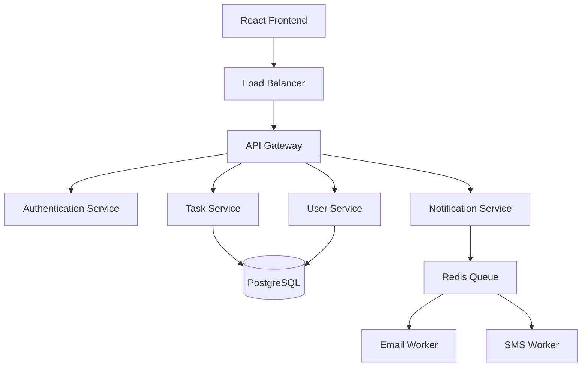
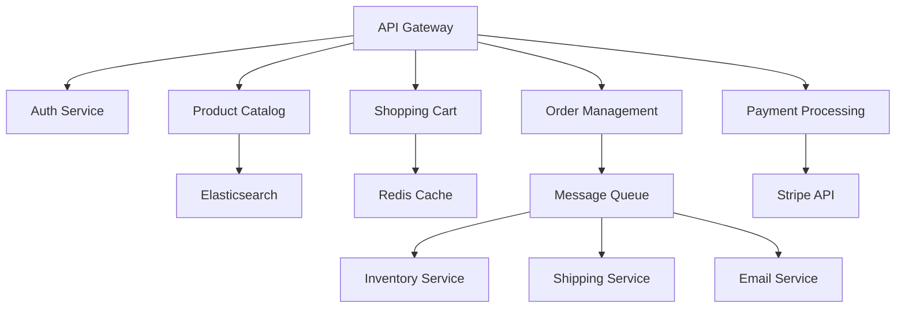

# Understanding the `/plan` Command in Spec-Kit

The `/plan` command transforms detailed requirements into a concrete technical architecture and implementation strategy. It's where business requirements meet technical reality, creating the blueprint that guides all subsequent development work.

## 🎯 What is `/plan`?

The `/plan` command creates **technical implementation plans** that include:
- **Technology stack** selection and justification
- **System architecture** and component design
- **Database schema** and data flow patterns
- **API design** and integration strategies
- **Deployment and infrastructure** requirements
- **Security implementation** approach

### Position in Spec-Kit Workflow

```
/constitution → /specify → /clarify → /plan → /tasks → /implement
Foundation → Requirements → Decisions → Architecture → Tasks → Code
```

## 🚨 Why `/plan` is Essential

### The Problem Without Technical Planning

Projects that jump from requirements to coding suffer from:

- **Architecture drift** - Inconsistent technical decisions across components
- **Integration nightmares** - Components that don't work together
- **Performance bottlenecks** - Scale problems discovered too late
- **Security vulnerabilities** - Security considered as an afterthought
- **Technical debt accumulation** - Quick fixes instead of proper design
- **Team inefficiency** - Developers make conflicting architectural choices

### The Solution: Comprehensive Technical Planning

The `/plan` command **prevents these issues** by:

✅ **Establishing consistent architecture** across all components  
✅ **Identifying integration points** before implementation begins  
✅ **Planning for scale and performance** from the start  
✅ **Integrating security** into the core design  
✅ **Creating implementation roadmap** with clear dependencies  

---

## 🛠️ How to Use `/plan` Effectively

### **Basic Usage Patterns**

#### **Technology Stack Planning**
```
/plan Create a technical architecture using React frontend, Node.js backend, PostgreSQL database, and AWS cloud infrastructure for a task management application
```

#### **Architecture-Focused Planning**
```
/plan Design a microservices architecture with API Gateway, containerized services, event-driven communication, and centralized monitoring for an e-commerce platform
```

#### **Integration-Heavy Planning**
```
/plan Build integration architecture connecting Salesforce CRM, Stripe payments, SendGrid emails, and Twilio SMS with proper error handling and retry mechanisms
```

### **Advanced Planning Techniques**

#### **Enterprise Application Planning**
```
/plan Design enterprise-grade architecture for customer support system:

TECHNICAL REQUIREMENTS:
- 99.9% uptime with automatic failover capabilities
- Support for 10,000+ concurrent users across multiple time zones
- Integration with existing Active Directory and SSO systems
- Compliance with SOC 2 Type II and GDPR requirements
- Real-time collaboration with sub-100ms latency

ARCHITECTURE CONSTRAINTS:
- Must use approved technology stack (Java Spring Boot, React, PostgreSQL)
- Deploy on existing Kubernetes infrastructure with CI/CD pipelines
- Integrate with enterprise monitoring and logging systems
- Follow established security patterns for data encryption and access control
- Support multi-tenant architecture with data isolation

SCALABILITY PLANNING:
- Horizontal auto-scaling based on CPU and memory metrics
- Database read replicas for reporting and analytics workloads
- CDN integration for static asset delivery and global performance
- Caching strategy with Redis for session management and API responses
- Message queue implementation for async processing and event handling
```

#### **Mobile-First Application Planning**
```
/plan Create mobile-first technical architecture for fitness tracking app:

MOBILE ARCHITECTURE:
- React Native for cross-platform development with native module integration
- Offline-first data synchronization with conflict resolution strategies
- Background processing for step counting and location tracking
- Push notification system with personalized scheduling and preferences
- Biometric authentication integration (Face ID, Touch ID, fingerprint)

BACKEND SERVICES:
- GraphQL API for flexible data querying and real-time subscriptions
- Microservices for user management, workout tracking, and social features
- Time-series database for fitness metrics with efficient compression
- Machine learning pipeline for personalized recommendations and insights
- File storage service for workout videos, progress photos, and avatars

PERFORMANCE OPTIMIZATION:
- Image compression and lazy loading for workout galleries
- Data prefetching based on user behavior patterns and prediction algorithms
- Battery optimization through intelligent background sync scheduling
- Bandwidth optimization with adaptive streaming and progressive download
- Local caching strategies for frequently accessed data and offline scenarios
```

---

## 📋 Technical Planning Components

### **System Architecture Design**

```markdown
## Task Management System Architecture Plan

### High-Level Architecture


### Component Responsibilities
- **API Gateway**: Request routing, rate limiting, authentication validation
- **Authentication Service**: JWT token management, password hashing, MFA support  
- **Task Service**: CRUD operations, business logic, search and filtering
- **User Service**: Profile management, preferences, team membership
- **Notification Service**: Event publishing, template management, delivery scheduling

### Data Flow Patterns
1. **User Authentication Flow**
   - Client → API Gateway → Auth Service → JWT Token → Client Storage
   - Subsequent requests include JWT in Authorization header
   - Token refresh handled automatically with sliding expiration

2. **Task Management Flow**
   - Create/Update: Client → API Gateway → Task Service → Database → Event Bus
   - Real-time Updates: Event Bus → WebSocket Service → Connected Clients
   - Search: Client → API Gateway → Task Service → Elasticsearch → Response

3. **Notification Flow**
   - Trigger Event → Notification Service → Queue System → Worker Processes
   - Email/SMS delivery with retry logic and failure handling
   - Delivery status tracking with webhook confirmation
```

### **Database Schema and Data Architecture**

```markdown
## Database Design Plan

### PostgreSQL Schema Design
```sql
-- Users table with authentication and profile data
CREATE TABLE users (
    id UUID PRIMARY KEY DEFAULT gen_random_uuid(),
    email VARCHAR(255) UNIQUE NOT NULL,
    password_hash VARCHAR(255) NOT NULL,
    first_name VARCHAR(100) NOT NULL,
    last_name VARCHAR(100) NOT NULL,
    avatar_url TEXT,
    created_at TIMESTAMP WITH TIME ZONE DEFAULT NOW(),
    updated_at TIMESTAMP WITH TIME ZONE DEFAULT NOW(),
    last_login_at TIMESTAMP WITH TIME ZONE,
    is_active BOOLEAN DEFAULT true
);

-- Projects table for organizing tasks
CREATE TABLE projects (
    id UUID PRIMARY KEY DEFAULT gen_random_uuid(),
    name VARCHAR(255) NOT NULL,
    description TEXT,
    owner_id UUID NOT NULL REFERENCES users(id),
    status VARCHAR(50) DEFAULT 'active',
    created_at TIMESTAMP WITH TIME ZONE DEFAULT NOW(),
    updated_at TIMESTAMP WITH TIME ZONE DEFAULT NOW()
);

-- Tasks table with full feature support
CREATE TABLE tasks (
    id UUID PRIMARY KEY DEFAULT gen_random_uuid(),
    project_id UUID NOT NULL REFERENCES projects(id) ON DELETE CASCADE,
    title VARCHAR(500) NOT NULL,
    description TEXT,
    assignee_id UUID REFERENCES users(id),
    creator_id UUID NOT NULL REFERENCES users(id),
    status VARCHAR(50) DEFAULT 'todo',
    priority VARCHAR(20) DEFAULT 'medium',
    due_date DATE,
    completed_at TIMESTAMP WITH TIME ZONE,
    created_at TIMESTAMP WITH TIME ZONE DEFAULT NOW(),
    updated_at TIMESTAMP WITH TIME ZONE DEFAULT NOW()
);
```

### Indexing Strategy
- **Performance Indexes**: user queries, project tasks, date ranges
- **Unique Constraints**: email addresses, project names per owner
- **Partial Indexes**: active records, incomplete tasks, recent activity
- **Composite Indexes**: multi-column queries, sorting optimization

### Data Partitioning Plan
- **Time-based partitioning**: Tasks by creation month for archival
- **User-based partitioning**: Large tenant data isolation
- **Read replicas**: Reporting queries separated from transactional load
- **Backup strategy**: Daily full backups with point-in-time recovery
```

### **API Design and Integration Architecture**

```markdown
## REST API Design Plan

### API Structure and Conventions
**Base URL**: `https://api.taskmanager.com/v1`  
**Authentication**: Bearer token (JWT) in Authorization header  
**Content Type**: JSON for all requests and responses  
**Error Format**: RFC 7807 Problem Details for HTTP APIs

### Core API Endpoints

#### Authentication Endpoints
```http
POST /auth/login
Content-Type: application/json

{
  "email": "user@example.com",
  "password": "securepassword"
}

Response: 200 OK
{
  "access_token": "eyJ0eXAiOiJKV1QiLCJhbGc...",
  "refresh_token": "dGhpcyBpcyBhIHJlZnJlc2g...",
  "expires_in": 3600,
  "user": {
    "id": "123e4567-e89b-12d3-a456-426614174000",
    "email": "user@example.com",
    "first_name": "John",
    "last_name": "Doe"
  }
}
```

#### Task Management Endpoints
```http
GET /projects/{project_id}/tasks?status=todo&assignee=current&sort=due_date
Authorization: Bearer {access_token}

Response: 200 OK
{
  "data": [
    {
      "id": "task-uuid-here",
      "title": "Implement user authentication",
      "status": "in_progress", 
      "priority": "high",
      "due_date": "2024-01-15",
      "assignee": {
        "id": "user-uuid",
        "name": "John Doe"
      }
    }
  ],
  "pagination": {
    "page": 1,
    "per_page": 25,
    "total": 47,
    "total_pages": 2
  }
}
```

### Integration Patterns
- **Webhook Support**: Real-time notifications to external systems
- **Rate Limiting**: 1000 requests per hour per API key with burst allowance
- **Versioning Strategy**: URL versioning with backward compatibility guarantees
- **Error Handling**: Consistent error codes with actionable error messages
- **Idempotency**: POST/PUT operations support idempotency keys
```

---

## 🌟 Real-World Planning Examples

### **Example 1: E-commerce Platform Technical Plan**

```markdown
# E-commerce Platform Technical Architecture Plan

## Technology Stack Selection

### Frontend Architecture
- **Framework**: Next.js 14 with App Router for server-side rendering and SEO optimization
- **Styling**: Tailwind CSS with custom design system components and dark mode support
- **State Management**: Zustand for client state, React Query for server state caching
- **Payment UI**: Stripe Elements with custom styling and multi-step checkout flow
- **Performance**: Image optimization, code splitting, and Progressive Web App features

### Backend Services Architecture
- **API Framework**: Node.js with Fastify for high-performance JSON APIs
- **Authentication**: Auth0 for user management with social login and enterprise SSO
- **Database**: PostgreSQL primary with Redis for sessions and caching
- **Search**: Elasticsearch for product catalog with faceted search and recommendations
- **File Storage**: AWS S3 with CloudFront CDN for product images and digital assets

### Microservices Design


## Performance and Scalability Plan

### Caching Strategy
- **Browser Caching**: Static assets cached for 1 year with versioning
- **CDN Caching**: Product images and catalog data cached globally
- **Application Caching**: Redis for user sessions, cart data, and API responses
- **Database Caching**: Query result caching with automatic invalidation

### Auto-Scaling Configuration
- **Horizontal Scaling**: Kubernetes HPA based on CPU (70%) and memory (80%) usage
- **Database Scaling**: Read replicas for catalog queries, connection pooling
- **CDN Optimization**: Edge caching with regional distribution and compression
- **Load Testing**: Target 1000 concurrent users with 2-second response times

## Security Implementation Plan

### Data Protection
- **Encryption**: TLS 1.3 for transit, AES-256 for sensitive data at rest
- **PCI Compliance**: Stripe handles card data, no sensitive payment info stored
- **User Data**: GDPR-compliant data handling with export and deletion capabilities
- **Session Management**: Secure JWT tokens with short expiration and refresh rotation

### API Security
- **Authentication**: OAuth 2.0 with PKCE flow for SPA security
- **Authorization**: Role-based access control with fine-grained permissions
- **Rate Limiting**: Sliding window rate limiting per user and endpoint
- **Input Validation**: Comprehensive request validation with sanitization
```

### **Example 2: Mobile Chat Application Technical Plan**

```markdown
# Mobile Chat Application Technical Architecture Plan

## Mobile-First Architecture

### Cross-Platform Development
- **Framework**: React Native 0.72+ with TypeScript for type safety and developer experience
- **Navigation**: React Navigation 6 with deep linking and state persistence
- **State Management**: Redux Toolkit with RTK Query for efficient API state management
- **Real-time**: Socket.io client with automatic reconnection and offline queue
- **Push Notifications**: Firebase Cloud Messaging with custom notification handling

### Native Module Integration
- **Camera/Media**: react-native-image-picker with compression and EXIF data handling
- **File Storage**: Encrypted local storage using react-native-keychain for sensitive data
- **Biometric Auth**: react-native-biometrics for Face ID/Touch ID authentication
- **Background Sync**: Background tasks for message synchronization when app is inactive
- **Network Detection**: Real-time connectivity monitoring with graceful degradation

## Backend Real-Time Architecture

### WebSocket Infrastructure
```javascript
// Socket.io server configuration
const io = new Server(httpServer, {
  cors: { origin: process.env.ALLOWED_ORIGINS },
  transports: ['websocket', 'polling'],
  pingTimeout: 60000,
  pingInterval: 25000
});

// Real-time message handling
io.use(authenticateSocket);
io.on('connection', (socket) => {
  socket.on('join_room', ({ roomId }) => {
    socket.join(roomId);
    socket.to(roomId).emit('user_joined', { userId: socket.userId });
  });
  
  socket.on('send_message', async ({ roomId, message }) => {
    const savedMessage = await saveMessage({ roomId, userId: socket.userId, message });
    io.to(roomId).emit('new_message', savedMessage);
    await sendPushNotification(roomId, savedMessage);
  });
});
```

### Message Delivery System
- **Delivery Guarantees**: At-least-once delivery with message deduplication
- **Offline Support**: Message queue with automatic retry when user comes online
- **Push Notifications**: Silent pushes for message sync, regular pushes for alerts
- **Message Encryption**: End-to-end encryption using Signal Protocol implementation
- **Media Handling**: Progressive upload with thumbnail generation and compression

## Database Design for Chat

### Message Storage Strategy
```sql
-- Optimized for chat workload patterns
CREATE TABLE chat_rooms (
    id UUID PRIMARY KEY,
    name VARCHAR(255),
    type VARCHAR(50), -- 'direct', 'group', 'channel'
    created_at TIMESTAMP WITH TIME ZONE DEFAULT NOW(),
    updated_at TIMESTAMP WITH TIME ZONE DEFAULT NOW()
);

-- Partitioned by date for efficient queries and archiving
CREATE TABLE messages (
    id UUID PRIMARY KEY,
    room_id UUID NOT NULL REFERENCES chat_rooms(id),
    sender_id UUID NOT NULL REFERENCES users(id),
    content TEXT NOT NULL,
    message_type VARCHAR(50) DEFAULT 'text', -- 'text', 'image', 'file', 'system'
    media_url TEXT,
    reply_to_id UUID REFERENCES messages(id),
    created_at TIMESTAMP WITH TIME ZONE DEFAULT NOW(),
    updated_at TIMESTAMP WITH TIME ZONE DEFAULT NOW()
) PARTITION BY RANGE (created_at);

-- Create monthly partitions for message archival
CREATE TABLE messages_2024_01 PARTITION OF messages
FOR VALUES FROM ('2024-01-01') TO ('2024-02-01');
```

### Performance Optimization
- **Message Pagination**: Cursor-based pagination for smooth infinite scroll
- **Index Strategy**: Compound indexes on (room_id, created_at) for message history
- **Archival Policy**: Messages older than 1 year moved to cold storage
- **Caching**: Recent messages cached in Redis with automatic expiration
```

---

## ⚠️ Common Anti-Patterns

### **Technology-First Instead of Requirement-First**
```
❌ "Let's use microservices because they're modern"
✅ "Given our team size and complexity requirements, a modular monolith with clear service boundaries provides better development velocity"

❌ "We should use NoSQL because it's scalable"
✅ "Based on our data relationships and query patterns, PostgreSQL with proper indexing meets our performance requirements while maintaining ACID properties"
```

### **Over-Engineering for Current Scale**
```
❌ "Build for 1 million users from day one"
✅ "Design architecture that can scale to 1 million users, but start with components that serve our current 1000 users efficiently"

❌ "Implement full microservices architecture for MVP"
✅ "Start with modular monolith, plan service boundaries for future extraction when scale demands it"
```

### **Ignoring Non-Functional Requirements**
```
❌ Planning only for functional features
✅ Include comprehensive planning for:
    - Performance (response times, throughput, resource usage)
    - Security (authentication, authorization, data protection)
    - Reliability (uptime, error rates, recovery procedures)
    - Maintainability (code organization, testing, monitoring)
    - Scalability (horizontal scaling, database sharding, CDN)
```

### **Insufficient Integration Planning**
```
❌ "We'll figure out integrations during implementation"
✅ "All external system integrations planned with:
    - Authentication and API key management
    - Error handling and retry strategies
    - Rate limiting and quota management
    - Webhook handling and event processing
    - Testing strategies for third-party dependencies"
```

---

## 📊 Success Metrics

### **Architecture Quality Indicators**

#### **Design Consistency**
- **Component interfaces** follow established patterns across the system
- **Error handling** strategies are consistent across all services
- **Authentication/authorization** patterns used uniformly
- **Data validation** approaches standardized across API endpoints

#### **Scalability Readiness**
- **Database queries** optimized with proper indexing strategies
- **Caching layers** planned for all performance-critical paths
- **Horizontal scaling** capabilities built into system design
- **Resource utilization** monitored with defined scaling triggers

### **Implementation Success Metrics**

#### **Development Velocity**
- **Faster feature development** due to clear technical patterns
- **Reduced integration issues** between components
- **Lower bug rates** from well-planned error handling
- **Smoother deployments** with proper CI/CD pipeline design

#### **System Performance**
- **Response times** meet specifications consistently
- **Resource utilization** stays within planned parameters
- **Error rates** remain below specified thresholds
- **Scalability targets** achieved without major rework

### **Team Alignment Indicators**
- Developers reference the technical plan during implementation
- Architecture decisions made consistently across the codebase
- Code reviews focus on plan adherence rather than design debates
- Technical debt stays minimal due to planned architecture patterns

---

## 🚀 Advanced Planning Techniques

### **Architecture Decision Records (ADRs)**

```markdown
# ADR-001: Database Technology Selection

## Status: Accepted

## Context
The task management system needs to store user data, projects, tasks, and relationships between these entities. We need to choose between SQL and NoSQL databases.

## Decision
We will use PostgreSQL as our primary database.

## Rationale
- **Strong consistency**: Task assignments and project permissions require ACID properties
- **Complex queries**: Reporting features need JOIN operations and aggregation functions
- **JSON support**: PostgreSQL JSONB provides flexibility for custom task fields
- **Mature ecosystem**: Well-supported ORMs, migration tools, and monitoring solutions
- **Team expertise**: Team has strong PostgreSQL experience

## Consequences
- **Positive**: Strong data consistency, mature tooling, team productivity
- **Negative**: Vertical scaling limitations, more complex sharding if needed
- **Mitigation**: Plan for read replicas, consider partitioning for large datasets

## Alternatives Considered
- **MongoDB**: Flexible schema but weaker consistency guarantees
- **DynamoDB**: Great for scale but limited query capabilities
- **MySQL**: Good option but PostgreSQL JSON support is superior
```

### **Layered Architecture Planning**

```typescript
// Domain-driven design with clean architecture
interface TaskManagementArchitecture {
  // Presentation Layer
  presentation: {
    webUI: ReactApplication;
    mobileUI: ReactNativeApplication;  
    publicAPI: RESTAPIEndpoints;
    webhooks: WebhookHandlers;
  };
  
  // Application Layer  
  application: {
    useCases: TaskUseCases;
    commandHandlers: CommandHandlers;
    eventHandlers: EventHandlers;
    queryHandlers: QueryHandlers;
  };
  
  // Domain Layer
  domain: {
    entities: [User, Project, Task];
    valueObjects: [TaskStatus, Priority];
    aggregates: ProjectAggregate;
    domainServices: TaskAssignmentService;
  };
  
  // Infrastructure Layer
  infrastructure: {
    database: PostgreSQLRepository;
    cache: RedisCache;
    messaging: EventBus;
    externalAPIs: IntegrationServices;
  };
}
```

### **Performance Planning with Benchmarks**

```markdown
## Performance Requirements and Testing Plan

### Load Testing Scenarios
1. **Normal Load**: 100 concurrent users, 80% read operations
2. **Peak Load**: 500 concurrent users, 60% read, 40% write operations  
3. **Stress Test**: 1000 concurrent users to identify breaking points
4. **Endurance Test**: 200 concurrent users for 4 hours to test memory leaks

### Performance Benchmarks
| Operation | Target | Measurement Method |
|-----------|--------|-------------------|
| Task Creation | < 200ms | p95 response time |
| Task List Load | < 100ms | p95 response time |
| Real-time Update | < 50ms | WebSocket message delivery |
| Search Query | < 300ms | p95 response time |
| File Upload | < 2s for 10MB | Upload completion time |

### Monitoring and Alerting Plan
- **APM Integration**: New Relic for request tracing and performance monitoring
- **Custom Metrics**: Task completion rates, user engagement, feature adoption
- **Alert Thresholds**: Response time > 500ms, error rate > 1%, CPU > 80%
- **Dashboard Setup**: Real-time system health with business metrics correlation
```

---

## 🎯 Planning Templates by Architecture Pattern

### **Microservices Architecture Template**
```markdown
# Microservices Planning Template

## Service Decomposition Strategy
### Service 1: [Service Name]
- **Business Capability**: [What business function does this serve?]
- **Data Ownership**: [What data does this service own?]
- **API Contract**: [What operations does it expose?]
- **Dependencies**: [What services does it depend on?]
- **Scaling Characteristics**: [How does load affect this service?]

## Cross-Cutting Concerns
- **Service Discovery**: Consul/Eureka with health checking
- **API Gateway**: Kong/Envoy with rate limiting and authentication
- **Configuration Management**: Centralized config with environment-specific overrides
- **Monitoring**: Distributed tracing with Jaeger, metrics with Prometheus
- **Security**: Service mesh with mTLS, JWT token validation

## Deployment Strategy
- **Containerization**: Docker with multi-stage builds for optimization
- **Orchestration**: Kubernetes with Helm charts for deployment automation
- **CI/CD Pipeline**: GitLab CI with automated testing and deployment
- **Environment Management**: Dev/staging/prod with infrastructure as code
```

### **Serverless Architecture Template**
```markdown
# Serverless Planning Template  

## Function Decomposition
### Function: [Function Name]
- **Trigger**: [HTTP API, Event, Schedule, etc.]
- **Runtime**: [Node.js, Python, Go with version]
- **Memory/Timeout**: [Allocated resources and execution limits]
- **Environment Variables**: [Configuration and secrets management]
- **Cold Start Optimization**: [Strategies to minimize startup time]

## Event-Driven Architecture
- **Event Sources**: [SQS, EventBridge, DynamoDB Streams]
- **Event Processing**: [Async processing patterns, error handling]
- **State Management**: [How to handle stateful operations]
- **Workflow Orchestration**: [Step Functions for complex workflows]

## Cost Optimization
- **Resource Right-Sizing**: [Memory allocation based on profiling]
- **Execution Optimization**: [Code efficiency, package size reduction]
- **Reserved Capacity**: [For predictable workloads]
- **Monitoring**: [AWS X-Ray for tracing, CloudWatch for metrics]
```

---

## 💡 Key Takeaways

1. **Architecture serves requirements** - Technology choices must align with functional and non-functional requirements
2. **Plan for change** - Design systems that can evolve as requirements change and scale grows
3. **Consider the full stack** - Plan frontend, backend, database, infrastructure, and DevOps together
4. **Document decisions** - Capture rationale for architectural choices for future reference
5. **Validate assumptions** - Prototype critical path components to verify technical feasibility

**Remember**: A great technical plan is a **bridge between business vision and implementation reality**. It transforms requirements into actionable architecture while considering constraints, trade-offs, and future evolution paths.

---

## 📚 Related Resources

- **[Constitution Guide](./Constitution.md)** - How principles guide architectural decisions
- **[Specify Guide](./Specify.md)** - Turning requirements into technical plans  
- **[Tasks Guide](./Tasks.md)** - Breaking plans into implementation tasks

---

*Plan with precision, build with confidence! 🏗️*
